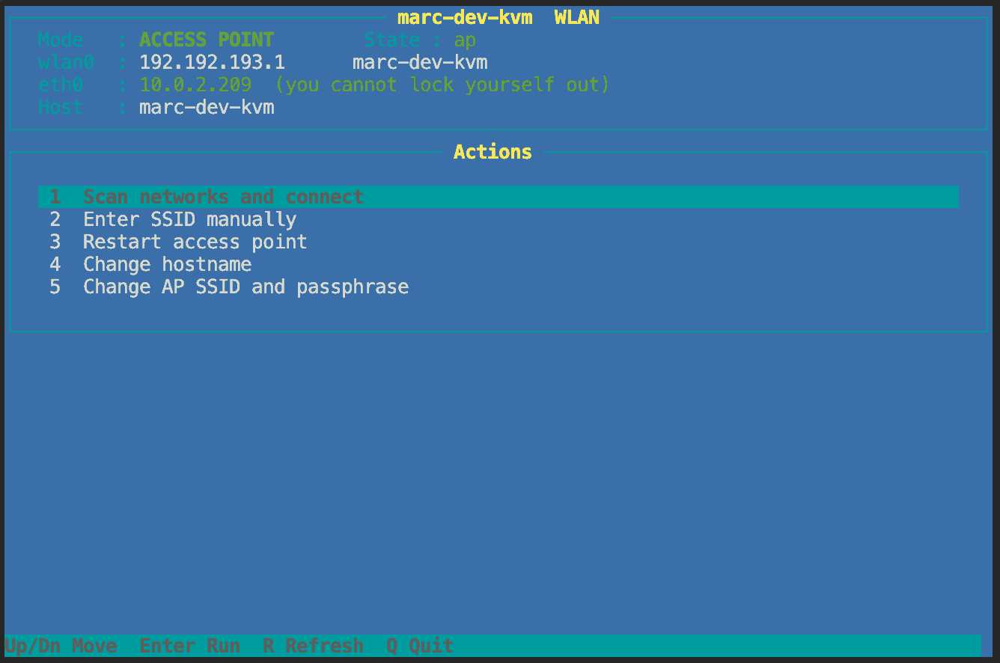

# WLAN

The RM1PE has a USB port and no wireless of its own. With the kernel from this
repository and a supported stick it does both halves of the job: it can run as
an **access point**, so you can reach the KVM without touching the network it
is plugged into, and it can join an existing network as a **client**, so the
KVM is on your WLAN with no cable at all.

The access point is useful when the machine you are rescuing *is* the router.
Client mode is what most people asked for after the first release: a KVM that
sits on the shelf and is reachable over the house network.

`wlan-menu.py` switches between the two.

## The stick we use

**Realtek RTL8188EU**, USB ID `0bda:8179`. Cheap, tiny, and it enumerates on the
built-in EHCI without a powered hub.

Two things to know about it:

* The in-kernel staging driver `r8188eu` is a **WEXT** driver. `iw` and
  everything else built on nl80211 will not talk to it; use `iwconfig` and
  `iwlist`, and `wpa_supplicant -D wext`. It also no longer has a usable AP
  interface, since `RTL_IOCTL_HOSTAPD` was removed.
* For access-point mode we therefore use the out-of-tree
  [aircrack-ng/rtl8188eus](https://github.com/aircrack-ng/rtl8188eus) driver,
  which registers through cfg80211 and works with hostapd.
* Firmware `rtlwifi/rtl8188eufw.bin` is not on the device. Take it from
  linux-firmware and put it in the overlay under `/lib/firmware/rtlwifi/`.

Module load order matters: `lib80211`, `lib80211_crypt_wep`,
`lib80211_crypt_ccmp`, then the driver.

## Using a different stick

Nothing here is specific to Realtek beyond the driver choice. To add another
chipset:

1. Enable its driver in the defconfig, built in or as a module. `patches/0003`
   already enables `CONFIG_ATH9K_HTC` and `CONFIG_MT7601U` next to the Realtek
   staging driver, so an Atheros AR9271 or a MediaTek MT7601U stick should come
   up without a rebuild.
2. Put any firmware it needs into `/lib/firmware/` in the overlay.
3. If you build it as an out-of-tree module, mind the vermagic: it must be
   `6.1.141 SMP mod_unload aarch64` exactly, and every kernel symbol it uses has
   to be exported. See the symbol check in [build.md](build.md).
4. Check whether the driver speaks nl80211 or only WEXT before you plan on AP
   mode.

Reports about other chipsets are welcome, open an issue and say what worked.

## Access point

Files in `wlan-ap/`, meant to be copied to `/userdata/wlan-ap/` on the device.
`hostapd` and `dnsmasq` are static builds we keep next to them; the RM1PE
rootfs ships neither.

```
ap-start.sh        entry point under its old name; execs wlan-apply.sh
wlan-apply.sh      brings wlan0 into the mode recorded in ./mode
wlan-menu.py       the menu: scan, join, switch back, rename, change the key
S99wlan-ap         goes to /etc/init.d/, starts the WLAN at boot
hostapd.conf.example   copy to hostapd.conf and set your own SSID and passphrase
dnsmasq.conf       DHCP, wildcard DNS, captive-portal options
captive.py         the state service behind the portal
portal/index.html  the page itself
nginx-ap-block.conf    the two server blocks to add to nginx
restart-cap.sh     restart the state service
```

Four binaries and one kernel module are not in the repository, because they are
build products rather than source. `install.sh` fetches them from the release,
verified against checksums pinned in the script:

```
/userdata/wlan-modules/8188eu.ko   the driver -- without it there is no wlan0
/userdata/wlan-ap/hostapd          access point
/userdata/wlan-ap/dnsmasq          DHCP and wildcard DNS
/userdata/wlan-ap/wpa_supplicant   client mode
/userdata/wlan-ap/wpa_cli          optional, for debugging a link
```

The AP lives on `192.192.193.1/24` and hands out `.100` to `.150`.

### Autostart, and a trap worth knowing

`/etc/init.d/rcS` expands its `for i in /etc/init.d/S??*` glob **once, at
start**, which is before `S08overlayfs` does its `pivot_root`. A script that
exists only in the overlay is invisible at that moment and is never started.
`rcK` re-globs at shutdown, when the overlay is active, so such a script gets
`stop` calls and never a `start`, which is a confusing thing to debug.

The fix is to hook into a script that exists in the lower filesystem. We call
`ap-start.sh` from the `start)` branch of `/etc/init.d/S99zerotier`, whose
contents are read from the overlay at execution time.

**Overlay-only init scripts never start on their own on this device.** Anything
you add needs the same treatment.

## The driver

The kernel from this repository enumerates the stick, and that is all it does.
The USB id shows up in `lsusb`, `dmesg` says `New USB device found, idVendor=
0bda, idProduct=8179` -- and then nothing. No `wlan0`, no access point, no
client mode.

What is missing is the driver. The in-tree `r8188eu` exists but does not do AP
mode, which is most of the point here, so we use the out-of-tree
[aircrack-ng/rtl8188eus](https://github.com/aircrack-ng/rtl8188eus) driver
instead. `scripts/build-8188eu.sh` builds it against the same kernel tree you
built the kernel from:

```sh
scripts/build-8188eu.sh ~/kvm/build-141 out-8188eu
scp out-8188eu/8188eu.ko root@<device>:/userdata/wlan-modules/
```

The module is tied to that kernel: `insmod` compares the vermagic string and
refuses anything else. So it cannot be built once and shipped forever -- a new
kernel version means a new module. `install.sh` checks this and says so rather
than leaving you with a silent `insmod` failure at boot.

`wlan-apply.sh` loads the module itself, so nothing else has to remember to.

## Building the userland

```sh
scripts/build-userland.sh out-userland
```

Produces `hostapd`, `dnsmasq`, `wpa_supplicant` and `wpa_cli`, all statically
linked for aarch64. hostapd and wpa_supplicant are built with
`CONFIG_TLS=internal` and no EAP, which drops the entire TLS and PKI stack --
WPA2 and WPA3 personal need none of it, and leaving it out is what makes a
static build reasonable instead of requiring a cross-compiled OpenSSL.

Static because the rootfs has no libnl and no package manager. A dynamic build
would mean shipping shared objects and an `LD_LIBRARY_PATH` on a device whose
only other link may be a WLAN switch that just failed.

The builds are not byte-reproducible -- paths and build ids end up in the
binaries, so your checksums will differ from the ones in the release. What you
can check is that the sources are the pinned upstream commits, which the script
verifies before it builds anything.

## Client mode

`wlan-apply.sh` reads `/userdata/wlan-ap/mode`, which holds `ap` or `client`,
and brings `wlan0` up accordingly. With no mode file it starts the access
point, which is what the device did before any of this existed. `wlan-menu.py`
writes that file and re-runs the script; nothing else needs to know.

### The menu

```sh
/userdata/wlan-ap/wlan-menu.py
```



Plain curses, so it works over SSH and over the serial console. The header
shows the mode, what `wlan0` currently has, and whether `eth0` is up -- that
last line is not decoration. It tells you whether a failed switch can lock you
out, and the confirmation prompt before switching says so in as many words.

Five actions: scan and join, enter an SSID by hand for a hidden network, switch
back to the access point (or restart it, if that is where you already are),
change the hostname, and change the AP's SSID and passphrase.

Two things behave differently than you might expect, both on purpose:

* **Scanning stops the access point.** One radio cannot serve an AP and scan at
  the same time. The menu asks first rather than doing it quietly, because
  anyone connected over the AP loses the link for the duration.
* **Scanning works without `wpa_supplicant`.** Only joining needs it. If the
  binary is missing you can still see what is in range, and the message says
  what to do about it.

### The watchdog

Switching to client mode from a session over the access point kills that
session mid-switch. `wlan-apply.sh` is therefore started detached and finishes
regardless. If association does not happen within 45 seconds, or DHCP does not
produce a lease within 15, it puts `mode` back to `ap` and brings the access
point up again by itself. Worst case you wait about a minute and the SSID is
back.

That is the whole safety story for a device with no wired link. With `eth0`
plugged in you have a way in either way, and the menu tells you which situation
you are in.

### An nginx trap that turned out not to be one

`nginx-ap-block.conf` binds `listen 192.192.193.1:80`, and in client mode that
address does not exist. The obvious worry is that nginx then refuses to start
at boot, taking the web interface down over Ethernet as well.

Measured, it does not happen: as long as a generic `listen 80` sits next to it
on the same port, nginx never opens a socket for the specific address at all.
It binds the wildcard once and picks the server block by the local address of
the accepted connection. A second instance was started with the address
deliberately absent and came up fine.

It would become real if you removed the generic block or added `bind`.
`wlan-apply.sh` sets `net.ipv4.ip_nonlocal_bind=1` on every run to cover that
case. It costs nothing and it is one fewer thing to remember.

## Captive portal

The point is modest: when you join the network, the address of the KVM appears
on its own, so you do not have to remember `192.192.193.1`.

How it fits together:

```
client joins
  -> dnsmasq: DHCP with router and DNS, wildcard DNS resolves every name to us
  -> the OS probes captive.apple.com (or gstatic, msftconnecttest, ...)
  -> nginx matches those hostnames and proxies to captive.py
  -> unknown client   -> 302 to /portal/?cna=1
     released client  -> the success answer that OS expects
  -> the portal shows the address and a copy button
```

`captive.py` keeps released clients in memory only, with a six-hour expiry, so
a rebooted AP shows the portal again and a recycled DHCP lease does not inherit
someone else's release.

nginx needs the two server blocks from `nginx-ap-block.conf` added to
`/etc/kvmd/nginx-kvmd.conf`. They bind `listen 192.192.193.1:80`, which is more
specific than the existing `listen 80` and therefore only affects clients on
the AP. Over Ethernet everything stays as it was, including the redirect to
HTTPS.

That file is static: the init script starts nginx with `-c` on it and never
regenerates it from the Mako template, so edits survive reboots. Back it up
before you touch it anyway.

### Plain HTTP on the AP, on purpose

The block for AP clients serves the KVM interface over plain HTTP. The device's
certificate is self-signed (`CN=localhost`), and a certificate warning inside
the captive-portal browser is a dead end for most people. The air link is
WPA2-encrypted and Ethernet keeps its HTTPS redirect. If you would rather not,
drop the second server block and accept the warning.

### What macOS will and will not do

This cost us an afternoon, so:

* You **cannot** open a real browser from the captive window. `window.open` and
  `target="_blank"` stay inside it. Foreign URL schemes are handed to
  LaunchServices, so any app with its own scheme can be launched, but
  `x-safari-http://` is blocked from there, at least on current macOS.
* The **user agent is not a reliable signal**. The system prober identifies as
  `CaptiveNetworkSupport-...`, but the web view inside the same window sends an
  ordinary Safari string. That is why `captive.py` marks the redirect with
  `?cna=1` and the page keys off that instead.
* The window **will not close on command**. Neither the release nor navigating
  to `captive.apple.com/hotspot-detect.html` (which then visibly says
  "Success") convinces macOS to dismiss it. The page therefore says plainly
  that the window can be closed.
* Once a network has been logged into successfully, macOS **stops showing the
  assistant** on later joins, whatever the server answers. To test the first-
  contact experience again you have to forget the network.

The result on a Mac: join, the window appears with the address, one click
copies it and marks you released, close the window, paste in a browser. Later
joins are silent. On iOS and Android the same flow works, with the usual
"use without internet" prompt.
